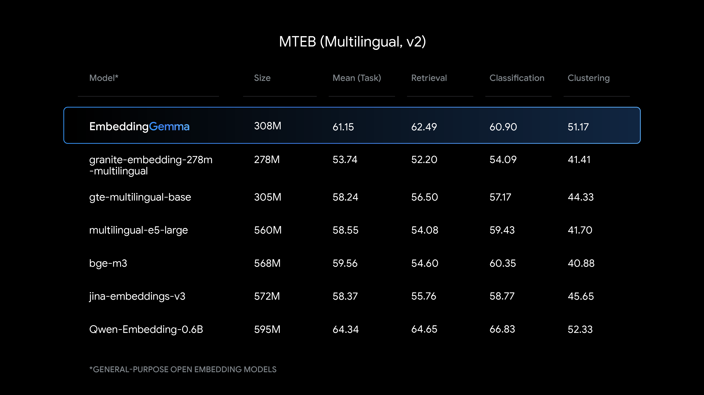
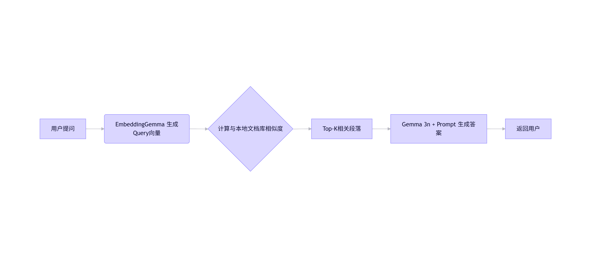

# 🌟 EmbeddingGemma 发布：最强开源轻量嵌入模型，专为端侧AI打造


> **参数规模**：308M（≈100M模型 + 200M嵌入层）\
> **核心定位**：**端侧RAG、离线语义搜索、多语言嵌入**\
> **硬件兼容**：手机 / 笔记本 / EdgeTPU / 消费级GPU\
> **内存占用**：**<200MB RAM（量化后）**\
> **上下文窗口**：2K tokens\
> **输出维度**：768 → 可裁剪至128/256/512（Matryoshka）\
> **推理速度**：**<15ms（EdgeTPU，256 tokens）**\
> **支持框架**：sentence-transformers, llama.cpp, Ollama, LangChain, LlamaIndex, Weaviate, LiteRT, transformers.js 等

***

## 🚀 一、摘要

**EmbeddingGemma 是当前 500M 参数以下最强开源多语言文本嵌入模型，在 <200MB 内存中实现服务器级语义理解能力，专为移动端 RAG、离线搜索、隐私优先场景设计，与 Gemma 3n 无缝协同。**

***

## 🏆 二、三大核心优势

### 1️⃣ 🥇 性能第一（Best-in-Class）

* **MTEB 多语言 v2 排名第一**（<500M 开源模型）
* **性能对标近两倍大小模型**（如 BGE-M3、E5-base）
* 特别擅长：
  * 多语言检索（100+语言）
  * 文本分类
  * 聚类任务
  * 语义相似度匹配

> 💡 **意义**：小模型 ≠ 弱性能，EmbeddingGemma 重新定义“轻量级嵌入模型”的天花板。

***

### 2️⃣ ⚡ 极致效率（On-Device Optimized）

| 指标             | 数值                          |
|------------------|-------------------------------|
| 参数总量         | 308M                          |
| 实际内存占用     | **<200MB RAM**（QAT量化后）   |
| 推理延迟         | **<15ms**（EdgeTPU，256 tokens） |
| 上下文长度       | 2048 tokens                   |
| 输出维度         | 768（支持 Matryoshka 裁剪）   |

#### ✅ Matryoshka Representation Learning（俄罗斯套娃表示学习）

* 单一模型输出多种维度：**768 → 512 → 256 → 128**
* **开发者可按需裁剪**：
  * 768维：最高精度（推荐用于RAG）
  * 256维：平衡速度与质量
  * 128维：极致压缩，适合移动端缓存

> 💡 **意义**：一套模型适配所有场景 —— 从高精度服务器到低功耗IoT设备。

***

### 3️⃣ 📱 离线优先 & 隐私安全（Offline by Design）

* **完全本地运行**：无网络依赖，数据不出设备
* **与 Gemma 3n 无缝集成**：
  * 构建完整端侧 RAG 流水线：
    <pre style="background: none"><code class="language-text" data-language="text" identifier="46bc68596987431cb14fbe00f72f9d09-0" index="0" total="5">用户提问 → EmbeddingGemma 检索本地文档 → Gemma 3n 生成答案</code></pre>
* **典型应用场景**：
  * 🔍 本地文件/邮件/消息全文语义搜索（无网可用）
  * 🤖 行业专属离线聊天机器人（医疗/法律/金融）
  * 🧠 移动端智能代理：查询分类 → 触发函数调用
  * 🛡️ 隐私敏感场景：健康记录、财务数据、内部通讯

> 💡 **Tokenizer共享**：与 Gemma 3n 使用相同词表，减少RAG流水线内存开销。

***

## 🧩 三、技术亮点解析

### 🔧 架构基础

* 基于 **Gemma 3 架构**（Decoder-only Transformer）
* 专为嵌入任务优化：最后一层输出池化 → 768维向量
* 训练方法：大规模对比学习 + 多语言对齐

### ⚙️ 量化与加速

* **Quantization-Aware Training (QAT)**：微调5k步，保持精度
* 支持格式：Int8 / Int4（通过 llama.cpp / MLX / LiteRT）
* **EdgeTPU 优化**：<15ms 响应，满足实时交互需求

### 🌐 多语言能力

* 训练语料覆盖 **100+ 语言**
* 在 MTEB Multilingual Benchmark 中显著领先同规模模型
* 特别优化中文、西班牙语、阿拉伯语、印地语等高需求语言

***

## 📊 四、性能对比（MTEB v2 多语言榜）


| 模型              | 参数量 | MTEB Avg Score | 内存占用 | 是否开源 | 端侧友好 |
|-------------------|--------|----------------|----------|----------|----------|
| **EmbeddingGemma**| 308M   | **🥇 第一名**   | <200MB   | ✅        | ✅✅✅     |
| BGE-M3            | ~560M  | 略高           | >500MB   | ✅        | ❌        |
| E5-base           | ~110M  | 低于EG         | ~300MB   | ✅        | ⚠️勉强    |
| Jina-Embeddings-v2| 137M   | 中等           | ~400MB   | ✅        | ❌        |
| Nomic-Embed       | 137M   | 中等偏低       | ~300MB   | ✅        | ⚠️        |

> ✅ **结论**：在 <500M 开源模型中，**EmbeddingGemma 综合性能、效率、多语言能力全面领先。**

***

## 🛠️ 五、快速上手？

### 1. 安装与加载（Hugging Face）

```python
from sentence_transformers import SentenceTransformer
model = SentenceTransformer("google/embeddinggemma-308m")
embeddings = model.encode(["你的句子1", "句子2"])
```


### 2. Ollama 本地运行

```Bash
ollama run embeddinggemma
```

### 3. 浏览器端运行（Transformers.js）

```Html
<script src="https://cdn.jsdelivr.net/npm/@xenova/transformers"></script>
<script>
  const model = await pipeline('feature-extraction', 'Xenova/embeddinggemma');
  const output = await model('Hello world');
</script>
```

### 4. 构建端侧 RAG（示例流程）



***

## 🎯 六、适用场景推荐

| 场景                  | 推荐配置              | 优势说明                     |
|-----------------------|-----------------------|------------------------------|
| 手机端全文搜索        | 128维 + Int4量化      | 极速响应，内存占用<50MB      |
| 离线行业知识库问答    | 768维 + Gemma 3n      | 高精度检索+生成              |
| 多语言客服分类        | 256维 + 多语言微调    | 快速路由，支持100+语言       |
| 隐私敏感数据处理      | 本地部署 + 无网模式   | 数据不出设备，符合GDPR/HIPAA |
| 边缘设备智能代理      | 512维 + 函数调用绑定  | 低延迟触发本地API/操作       |

> 📝 **支持微调**：提供 [Colab 快速入门笔记本](https://colab.research.google.com/github/google/gemma-notebooks)，可针对垂直领域/特定语言优化。

***

## 🔄 七、Google 嵌入模型矩阵（选型指南）

| 模型               | 定位                 | 参数量   | 是否开源 | 最佳场景             |
|--------------------|----------------------|----------|----------|----------------------|
| **EmbeddingGemma** | **端侧首选**         | 308M     | ✅        | 移动端RAG、离线搜索  |
| Gemini Embedding   | 云端最强             | 未公开   | ❌（API） | 企业级高并发服务     |
| Universal Sentence Encoder | 通用老将       | 100M+    | ✅        | 基础语义任务         |

> 💡 **选型建议**：
>
> * 要**离线、隐私、移动端** → **EmbeddingGemma**
> * 要**最高精度、云端部署** → **Gemini Embedding API**
> * 要**极小模型、简单任务** → 考虑 Nomic 或 MiniLM

***

## 📌 八、行业影响与生态意义

* **填补空白**：首个专为端侧优化的**高性能多语言开源嵌入模型**
* **推动端侧AI**：让 RAG、语义搜索、智能代理真正落地手机/PC
* **隐私革命**：敏感数据无需上传云端，满足全球合规要求
* **生态整合**：与 Gemma 3n 形成“检索+生成”黄金组合，构建完整端侧LLM方案
* **开发者友好**：主流框架全覆盖，零门槛迁移

***

## 🔮 九、未来展望

* **更小版本**：推出 100M 以下超轻量版，适配 IoT 设备
* **视觉嵌入**：探索图像→文本联合嵌入（与 SigLIP 结合）
* **动态裁剪**：运行时自动选择最优维度（基于设备性能）
* **联邦学习支持**：允许多设备协同微调，保护数据隐私

***

## 📎 附录：关键数据速查卡

| 特性                | 详情                                  |
|---------------------|---------------------------------------|
| 模型名称            | EmbeddingGemma                        |
| 参数规模            | 308M（100M模型 + 200M嵌入层）        |
| 上下文长度          | 2048 tokens                           |
| 输出维度            | 768（支持128/256/512裁剪）           |
| 多语言支持          | 100+ 语言                             |
| 内存占用            | <200MB RAM（Int8 QAT）               |
| 推理速度            | <15ms（EdgeTPU，256 tokens）         |
| 量化支持            | Int8, Int4（QAT微调）                |
| 开源协议            | 预计沿用 Gemma 宽松许可证             |
| 配套工具            | Gemma 3n + ShieldGemma 2 + LiteRT     |
| 适用硬件            | 手机 / 笔记本 / EdgeTPU / 树莓派      |

